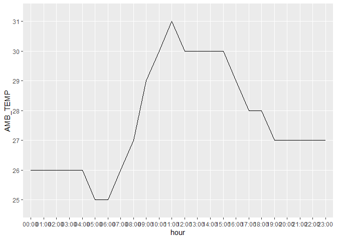
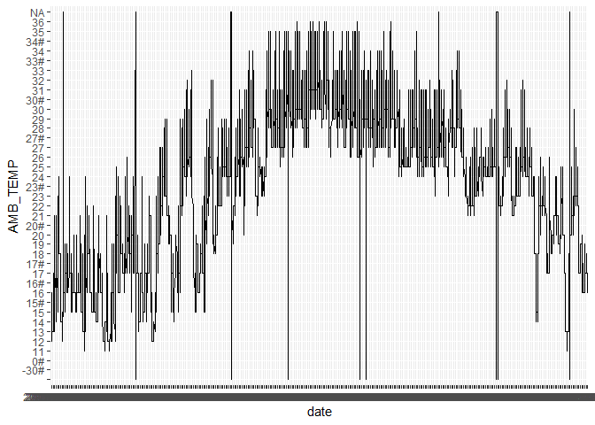
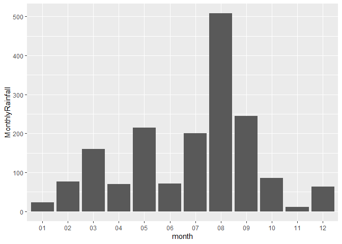
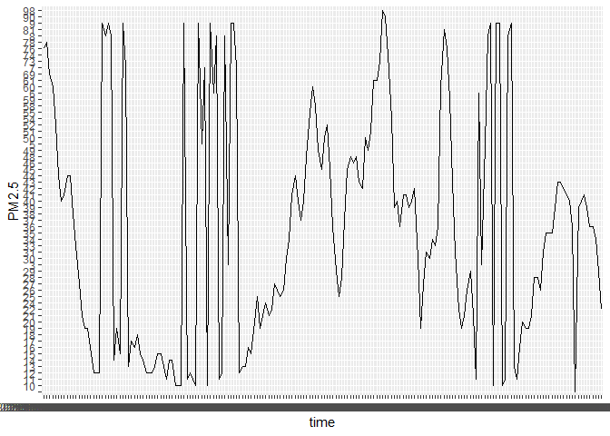

assignment-6
================
Gisela E. Noguera Toffoletti

# Assignment 6: Data import and tidy data

``` r
library(tidyverse)
library(knitr)
library(janitor)
library(ggplot2)
```

<br>

## Exercise 1. Tibble and Data Import

Import the data frames listed below into R and
[parse](https://r4ds.had.co.nz/data-import.html#parsing-a-vector) the
columns appropriately when needed. Watch out for the formatting oddities
of each dataset. Print the results directly, **without** using
`kable()`.

**You only need to finish any three out of the five questions in this
exercise in order to get credit.**

<br>

#### 1.1 Create the following tibble manually, first using `tribble()` and then using `tibble()`. Print both results. $$We didn’t have time to cover this in class, but look up how these functions work [here](https://r4ds.had.co.nz/tibbles.html#creating-tibbles)$$

``` r
tribble(
  ~a, ~b, ~c,
  1,2.1, "apple",
  2, 3.2, "orange"
)
```

    ## # A tibble: 2 × 3
    ##       a     b c     
    ##   <dbl> <dbl> <chr> 
    ## 1     1   2.1 apple 
    ## 2     2   3.2 orange

``` r
tibble(a = c(1,2),
       b = c(2.1,3.2),
       c = c("apple","orange"))
```

    ## # A tibble: 2 × 3
    ##       a     b c     
    ##   <dbl> <dbl> <chr> 
    ## 1     1   2.1 apple 
    ## 2     2   3.2 orange

<br>

#### 1.2 Import `https://raw.githubusercontent.com/nt246/NTRES-6100-data-science/master/datasets/dataset2.txt` into R. Change the column names into “Name”, “Weight”, “Price”.

``` r
data_12 <- read_delim("https://raw.githubusercontent.com/nt246/NTRES-6100-data-science/master/datasets/dataset2.txt", col_names = c("Name", "Weight", "Price"))
data_12
```

    ## # A tibble: 3 × 3
    ##   Name   Weight Price
    ##   <chr>   <dbl> <dbl>
    ## 1 apple       1   2.9
    ## 2 orange      2   4.9
    ## 3 durian     10  19.9

<br>

#### 1.3 Import `https://raw.githubusercontent.com/nt246/NTRES-6100-data-science/master/datasets/dataset3.txt` into R. Watch out for the first few lines, missing values, separators, quotation marks, and deliminaters.

``` r
data_13 <- read_delim("https://raw.githubusercontent.com/nt246/NTRES-6100-data-science/master/datasets/dataset3.txt", skip = 2, na = c("?","Not Available"))
data_13 |> 
  mutate(`/Name/`= str_replace_all(`/Name/`,"/","")) |> 
  clean_names('upper_camel')
```

    ## # A tibble: 3 × 3
    ##   Name   Weight Price
    ##   <chr>   <dbl> <dbl>
    ## 1 apple       1   2.9
    ## 2 orange      2  NA  
    ## 3 durian     NA  19.9

<br>

#### 1.4 Import `https://raw.githubusercontent.com/nt246/NTRES-6100-data-science/master/datasets/dataset4.txt` into R. Watch out for comments, units, and decimal marks (which are `,` in this case).

<br>

#### 1.5 Import `https://raw.githubusercontent.com/nt246/NTRES-6100-data-science/master/datasets/dataset5.txt` into R. Parse the columns properly. As a reminder, you can read about parsing date and time data [here](https://r4ds.had.co.nz/data-import.html#readr-datetimes). Write this imported and parsed data frame into a new csv file named `dataset5_new.csv` in your `problem_sets` folder.

<br>

## Exercise 2. Weather station

This dataset contains the weather and air quality data collected by a
weather station in Taiwan. It was obtained from the Environmental
Protection Administration, Executive Yuan, R.O.C. (Taiwan).

#### 2.1 Variable descriptions

- The text file
  `https://raw.githubusercontent.com/nt246/NTRES-6100-data-science/master/datasets/2015y_Weather_Station_notes.txt`
  contains descriptions of different variables collected by the station.
  <br>
- Import it into R and print it in a table as shown below with
  `kable()`.

<br>

``` r
read_delim("https://raw.githubusercontent.com/nt246/NTRES-6100-data-science/master/datasets/2015y_Weather_Station_notes.txt", delim = "-") |> 
  kable()
```

| Item       | Unit    | Description                                               |
|:-----------|:--------|:----------------------------------------------------------|
| AMB_TEMP   | Celsius | Ambient air temperature                                   |
| CO         | ppm     | Carbon monoxide                                           |
| NO         | ppb     | Nitric oxide                                              |
| NO2        | ppb     | Nitrogen dioxide                                          |
| NOx        | ppb     | Nitrogen oxides                                           |
| O3         | ppb     | Ozone                                                     |
| PM10       | μg/m3   | Particulate matter with a diameter between 2.5 and 10 μm  |
| PM2.5      | μg/m3   | Particulate matter with a diameter of 2.5 μm or less      |
| RAINFALL   | mm      | Rainfall                                                  |
| RH         | %       | Relative humidity                                         |
| SO2        | ppb     | Sulfur dioxide                                            |
| WD_HR      | degress | Wind direction (The average of hour)                      |
| WIND_DIREC | degress | Wind direction (The average of last ten minutes per hour) |
| WIND_SPEED | m/sec   | Wind speed (The average of last ten minutes per hour)     |
| WS_HR      | m/sec   | Wind speed (The average of hour)                          |

<br> `#` indicates invalid value by equipment inspection  
`*` indicates invalid value by program inspection  
`x` indicates invalid value by human inspection  
`NR` indicates no rainfall  
blank indicates no data

<br>

#### 2.2 Data tidying

- Import
  `https://raw.githubusercontent.com/nt246/NTRES-6100-data-science/master/datasets/2015y_Weather_Station.csv`
  into R. As you can see, this dataset is a classic example of untidy
  data: values of a variable (i.e. hour of the day) are stored as column
  names; variable names are stored in the `item` column.

- Clean this dataset up and restructure it into a tidy format.

- Parse the `date` variable into date format and parse `hour` into time.

- Turn all invalid values into `NA` and turn `NR` in rainfall into `0`.

- Parse all values into numbers.

- Show the first 6 rows and 10 columns of this cleaned dataset, as shown
  below, *without* using `kable()`.

*Hints: you don’t have to perform these tasks in the given order; also,
warning messages are not necessarily signs of trouble.*

<br>

Before cleaning:

``` r
data2 <- read_csv("https://raw.githubusercontent.com/nt246/NTRES-6100-data-science/master/datasets/2015y_Weather_Station.csv",  na = c("NA")) |> 
  mutate_all(as.character) |> 
  mutate(
    across(everything(), ~ replace(., . == "NR", 0)))

data2 |> 
  head()
```

    ## # A tibble: 6 × 27
    ##   date       station item  `00`  `01`  `02`  `03`  `04`  `05`  `06`  `07`  `08` 
    ##   <chr>      <chr>   <chr> <chr> <chr> <chr> <chr> <chr> <chr> <chr> <chr> <chr>
    ## 1 2015-01-01 Cailiao AMB_… 16    16    15    15    15    14    14    14    14   
    ## 2 2015-01-01 Cailiao CO    0.74  0.7   0.66  0.61  0.51  0.51  0.51  0.6   0.62 
    ## 3 2015-01-01 Cailiao NO    1     0.8   1.1   1.7   2     1.7   1.9   2.4   3.4  
    ## 4 2015-01-01 Cailiao NO2   15    13    13    12    11    13    13    16    16   
    ## 5 2015-01-01 Cailiao NOx   16    14    14    13    13    15    15    18    19   
    ## 6 2015-01-01 Cailiao O3    35    36    35    34    34    32    30    26    26   
    ## # ℹ 15 more variables: `09` <chr>, `10` <chr>, `11` <chr>, `12` <chr>,
    ## #   `13` <chr>, `14` <chr>, `15` <chr>, `16` <chr>, `17` <chr>, `18` <chr>,
    ## #   `19` <chr>, `20` <chr>, `21` <chr>, `22` <chr>, `23` <chr>

``` r
#col_types = col(.defaults = "c") => import the data
#mutate(RAINFALL = ifelse(RAINFALL == "NR", 0, RAINFALL) |> 
#type_convert(col_types = cols(.default = col_double(), date = col_date(), station = col_character(), hour = col_time("%H")))
```

<br>

After cleaning:

``` r
new_data <- data2 |> 
  pivot_longer(c(`00`:`23`), names_to = "hour") |> 
  pivot_wider(names_from = item, values_from = value) |> 
  mutate(
    hour = paste0(hour,":00"))
  
head(new_data)
```

    ## # A tibble: 6 × 18
    ##   date       station hour  AMB_TEMP CO    NO    NO2   NOx   O3    PM10  PM2.5
    ##   <chr>      <chr>   <chr> <chr>    <chr> <chr> <chr> <chr> <chr> <chr> <chr>
    ## 1 2015-01-01 Cailiao 00:00 16       0.74  1     15    16    35    171   76   
    ## 2 2015-01-01 Cailiao 01:00 16       0.7   0.8   13    14    36    174   78   
    ## 3 2015-01-01 Cailiao 02:00 15       0.66  1.1   13    14    35    160   69   
    ## 4 2015-01-01 Cailiao 03:00 15       0.61  1.7   12    13    34    142   60   
    ## 5 2015-01-01 Cailiao 04:00 15       0.51  2     11    13    34    123   52   
    ## 6 2015-01-01 Cailiao 05:00 14       0.51  1.7   13    15    32    110   44   
    ## # ℹ 7 more variables: RAINFALL <chr>, RH <chr>, SO2 <chr>, WD_HR <chr>,
    ## #   WIND_DIREC <chr>, WIND_SPEED <chr>, WS_HR <chr>

<br>

#### 2.3 Using this cleaned dataset, plot the daily variation in ambient temperature on September 25, 2015, as shown below.

``` r
new_data$hour <- factor(new_data$hour)
new_data |> 
  select(hour, AMB_TEMP, date) |> 
  filter(date == "2015-09-25") |> 
  ggplot(mapping = aes(x = hour, y = AMB_TEMP, group = 1)) +
  geom_line()
```

<!-- -->

<br>

#### 2.4 Plot the daily average ambient temperature throughout the year with a **continuous line**, as shown below.

``` r
new_data$date <- factor(new_data$date)
new_data |> 
  select(hour,AMB_TEMP,date) |> 
  ggplot(mapping = aes(x = date, y = AMB_TEMP, group = 1)) +
  geom_line() 
```

<!-- -->

<br>

#### 2.5 Plot the total rainfall per month in a bar chart, as shown below.

*Hint: separating date into three columns might be helpful.*

``` r
new_data |> 
  mutate(
    month = format(as.Date(date), "%m"),
    RAINFALL = as.numeric(RAINFALL)) |> 
  group_by(month) |> 
  summarise(
    MonthlyRainfall = sum(RAINFALL, na.rm = T)
  ) |> 
  ggplot(mapping = aes(x = month, y = MonthlyRainfall)) +
  geom_col()
```

<!-- -->

<br>

#### 2.6 Plot the per hour variation in PM2.5 in the first week of September with a **continuous line**, as shown below.

*Hint: uniting the date and hour and parsing the new variable might be
helpful.*

``` r
new_data <- new_data |> 
  mutate(
    time = parse_datetime(paste(date, hour), format = "%Y-%m-%d %H:%M"))
new_data$time <- factor(new_data$time) 
new_data |> 
  filter(between(as.Date(time), as.Date("2015-01-01"), as.Date("2015-01-08"))) |> 
  ggplot(mapping = aes(x = time, y = PM2.5, group = 1)) +
  geom_line() 
```

<!-- -->

<br>
